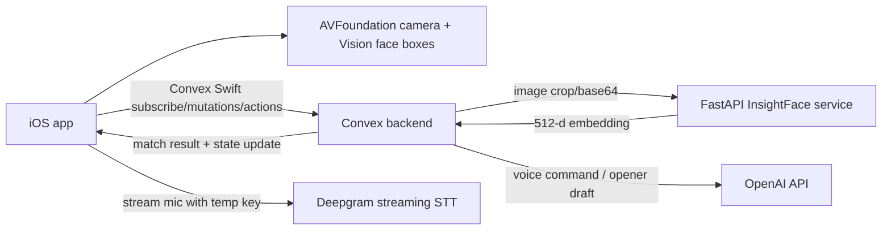

# Recco Four-Person Handoff Plan

## Product in one sentence

Recco is a camera-first networking assistant for a hackathon/event demo: point the iPhone camera at 3-5 enrolled people, see useful profile overlays, then use voice to ask who to talk to and what to say.

## Demo promise

The stage demo must show this sequence cleanly:

1. Open iOS app to the camera.
2. Point at one enrolled participant.
3. A face box locks on and a profile overlay appears.
4. Point at 2-3 participants.
5. Voice command: "show me AI founders" or "who should I talk to about infra?"
6. Matching people brighten; non-matches dim or hide.
7. Tap a person and generate a short opener.
8. Optional Brain view shows the enrolled/event roster as a graph.

Everything else is secondary.

## Scope lock

Build only:

- Camera face detection/tracking.
- Recognition against a small enrolled roster.
- Profile overlays.
- Voice command to filter/rank.
- Profile card.
- Short opener/email draft.
- Brain graph view as secondary visual/fallback.
- Manual chips as voice fallback.

Do not build:

- Real outbound sending.
- Calendar booking.
- Full social scraping.
- Crowd-scale recognition from far away.
- Complex auth.
- Production privacy/settings screens.
- Multi-event admin dashboards.

## Team split

There are four people:

- Person 1: Computer Vision Service
- Person 2: CV Data, Matching, and Convex Backend
- Person 3: iOS Camera, Tracking, and Overlay
- Person 4: iOS Brain, Voice, Profiles, and Demo Flow

The key management rule: each person owns a vertical lane, but everyone builds to the contracts in `docs/API_CONTRACTS.md`.

## Shared architecture



For the demo, the app can also run with mocks:

- Mock CV match by photo/person ID.
- Mock voice command using buttons/chips.
- Mock opener with template strings.

Mocks are not shameful. They keep the demo alive while real integrations come online.

## Folder targets

Expected implementation folders:

- `app/ios/Recco/` - native Swift iOS app.
- `backend/convex/` - Convex functions, schema, seed scripts.
- `cv-service/` - FastAPI service wrapping InsightFace.
- `demo-data/` - sample roster, enrollment photos, generated embeddings.
- `open-source/` - cloned references only.

## Person 1: Computer Vision Service

### Mission

Own the Python service that turns a face image into a normalized 512-dimensional embedding.

### Primary repo reference

- `open-source/insightface`

### Deliverables

1. `cv-service/requirements.txt`
2. `cv-service/main.py`
3. `cv-service/README.md`
4. `GET /health`
5. `POST /embed`
6. Local test script that sends an image and prints embedding length.
7. Optional `POST /debug/detect` for testing face boxes.

### Required behavior

`POST /embed` accepts one face crop or one full image. For the first version, assume iOS sends a face crop. If full images are sent, the service may detect the biggest face.

Response must include:

- `embedding`: 512 floats, L2-normalized.
- `faceDetected`: boolean.
- `quality`: basic data like crop size and detection score if available.
- `error`: string when no usable face is found.

### Suggested implementation

- Use FastAPI.
- Use `insightface.app.FaceAnalysis`.
- Start with model pack `buffalo_l` if setup works.
- If setup is too slow, use `buffalo_s` or DeepFace/ArcFace as a fallback.
- Normalize embeddings before returning.
- Keep service stateless. It should not know the roster.

### Performance target

For a cropped face:

- Local dev acceptable: under 1.5 seconds per request.
- Demo target: under 800 ms if running warm.
- If slower, iOS can show "scanning" and cache results per face track.

### Done when

- `curl /health` returns ok.
- One enrollment image returns 512 floats.
- Bad/no-face image returns a clean error, not a server crash.
- Person 2 can call it from Convex or a backend script.

### Fallback if blocked

If InsightFace setup burns too much time:

- Return deterministic mock embeddings for named demo images.
- Or run a tiny local matching endpoint with precomputed fixtures.
- Tell Person 2 immediately so the Convex action can keep the same response shape.

## Person 2: CV Data, Matching, and Convex Backend

### Mission

Own the backend data model and the server-side actions that connect iOS, CV, OpenAI, and reactive app state.

### Primary repo references

- `open-source/convex-templates`
- `open-source/convex-helpers`
- `open-source/convex-swift`

### Deliverables

1. `backend/convex/` project.
2. Convex schema for people, app state, face match events, and drafts.
3. Seed function/script that loads `demo-data/people.sample.json`.
4. Enrollment script that reads enrollment images, calls Person 1's CV service, and stores embeddings.
5. `people:list` query.
6. `state:get` reactive query.
7. `state:setFilter` mutation.
8. `vision:matchFace` action.
9. `voice:interpretCommand` action.
10. `drafts:createOpener` action.
11. `voice:getDeepgramToken` action, if using Deepgram live.

### Required backend principle

The iOS app should not contain OpenAI keys or Deepgram permanent keys. Server actions issue temporary credentials or call APIs directly.

### Matching strategy

For the hackathon, do not overbuild vector search.

Use this simple path:

1. Store each enrolled person's 512-d embedding in Convex.
2. `vision:matchFace` receives image base64 from iOS.
3. Convex action calls Person 1's `/embed`.
4. Convex compares the returned embedding against all enrolled people using cosine similarity.
5. If best score is above threshold, return the person and write `state.highlightedPersonId`.

This is fine for 5 demo people and still fine for 200 event profiles.

### Default thresholds

Start with configurable values:

- `strongMatchScore`: 0.38
- `tentativeMatchScore`: 0.30

Tune these with real demo photos. The threshold matters less than making low-confidence results quiet.

### Voice command strategy

OpenAI turns transcript text into this JSON:

```json
{
  "action": "filter",
  "includeTags": ["AI", "Founder"],
  "excludeTags": [],
  "rankBy": "relevance",
  "targetPersonId": null,
  "rawText": "show me AI founders"
}
```

Keep the vocabulary small. Suggested tags:

- AI
- Founder
- Infra
- Rust
- Python
- Design
- Growth
- DevTools
- ML
- Search
- Seed
- Backend
- Frontend
- Product
- GoToMarket
- Evaluation

### Done when

- iOS can subscribe to `state:get`.
- iOS can fetch people.
- Manual filter mutation changes returned/derived state.
- `vision:matchFace` returns a match from a test image.
- `voice:interpretCommand("show me AI founders")` returns usable JSON.
- `drafts:createOpener(personId)` returns 1-3 short lines.

### Fallback if blocked

If Convex Swift integration is slow:

- Expose simple HTTP endpoints from a dev server or use Convex HTTP actions.
- Let iOS poll every 1 second for demo state.
- Keep response JSON identical to `docs/API_CONTRACTS.md`.

## Person 3: iOS Camera, Tracking, and Overlay

### Mission

Own the camera-first experience: live camera, face boxes, stable tracking, cropped face capture, and profile overlays.

### iOS APIs

- AVFoundation for camera session.
- Vision for face detection/tracking.
- SwiftUI wrapper around camera preview.

### Deliverables

1. Camera opens full-screen on app launch.
2. Face rectangles render over the camera preview.
3. Each visible face gets a stable temporary `trackId`.
4. The app crops each tracked face and sends it to the backend no more than once every 0.8-1.5 seconds per track.
5. Overlay card anchors near the face box when a match returns.
6. Unknown/low-confidence faces stay quiet or show a subtle scanning state.
7. Filters from app state can dim/hide non-matching overlays.

### Required UX

Camera mode is the hero screen. It should not feel like a settings app.

Overlay card minimum:

- Name
- Role/company
- 2-4 tags
- "Why talk" one-liner
- Confidence indicator only in debug mode

### Tracking rules

- Do not send every frame to the backend.
- Cache match results per `trackId`.
- Reuse a match while the face box moves smoothly.
- Retry recognition when the face changes a lot, confidence is low, or the cache expires.
- Add a debug toggle showing boxes, scores, and request timing.

### Interface with Person 2

Person 3 calls:

- `vision:matchFace(imageBase64, trackId)` action.
- `state:get` subscription.

Person 3 consumes:

- `FaceMatchResult`
- `BrainState`
- `Person`

### Done when

- With fake match responses, the overlay feels stable.
- With real backend, one enrolled person is recognized live.
- With 2-3 people in frame, overlays do not jump wildly.
- Manual filter chips can dim non-matching overlays.

### Fallback if blocked

If live recognition is flaky:

- Add a "scan" button to capture one frame intentionally.
- Recognize one person at a time.
- For stage, ask demo participants to stand close and face the camera.
- Use printed enrollment photos as a backup demo target.

## Person 4: iOS Brain, Voice, Profiles, and Demo Flow

### Mission

Own the app shell, voice command loop, Brain graph, profile cards, opener drafting, and final demo flow.

### Primary repo references

- `open-source/grape`
- `open-source/deepgram-nextjs-live-transcription`
- `open-source/deepgram-live-transcripts-ios`
- `open-source/convex-swift`

### Deliverables

1. SwiftUI app shell.
2. Shared `AppModel` or store for people, state, selected person, transcript, and drafts.
3. Grape Brain view with 5-50 people.
4. Manual chips that call the same filter path as voice.
5. Voice capture/transcript ribbon.
6. Final transcript sent to `voice:interpretCommand`.
7. Profile detail sheet.
8. "Draft opener" button and output panel.
9. Demo mode switch with mock/local data.

### Voice behavior

The app must feel alive before the AI response comes back.

When the user speaks:

1. Show partial transcript immediately.
2. Show subtle "thinking" or shimmer state after final transcript.
3. Apply returned filter state.
4. Animate overlays/graph, do not snap.

### Brain graph behavior

Brain view is secondary but valuable:

- All demo roster people appear as nodes.
- Current filter brightens matching nodes.
- Non-matches dim.
- Cluster/group by tags if time allows.
- Tap node opens same profile detail as camera overlay.

### Demo commands to support

The final demo only needs these:

- "Show me AI founders."
- "Who should I talk to about infra?"
- "Only growth people."
- "Draft an opener for Ava."
- "Reset."

Manual chips must cover the same:

- AI
- Founder
- Infra
- Growth
- Design
- Reset

### Done when

- The app works with `demo-data/people.sample.json` without backend.
- The app can switch to Convex people/state when backend is ready.
- Voice can be faked with typed/fixed commands if Deepgram is down.
- Profile and opener flow works from both camera overlay and Brain node.

### Fallback if blocked

If Grape fights the build:

- Use a simple radial/grid Brain view.
- Or use `directed-graph-fallback`.
- Do not let graph polish block the camera demo.

If Deepgram fights the build:

- Use iOS speech recognition or a typed command bar.
- Keep the same command JSON contract.
- Manual chips are the stage parachute.

## Integration checkpoints

### Checkpoint 0: Contract freeze, first 45 minutes

Everyone reads `docs/API_CONTRACTS.md`.

Decide:

- Exact local ports.
- Exact Convex function names.
- Whether iOS sends base64 JPEG or multipart via action/upload.
- Demo participant names and tags.

After this, avoid shape changes unless all four people agree.

### Checkpoint 1: Fake end-to-end, hour 3

Goal:

- iOS camera shows fake overlay for fake person.
- Manual chip changes app state.
- Brain/profile UI can open same fake person.

No CV required yet.

### Checkpoint 2: Backend end-to-end, hour 6

Goal:

- Convex seeded with 5 people.
- iOS fetches people from Convex.
- Manual filter mutation updates reactive state.
- Person 1 service returns real or mock embedding.

### Checkpoint 3: One real face, hour 9

Goal:

- iOS sends one face crop.
- Convex action calls CV service.
- Match returns a real person.
- Overlay appears near the face.

### Checkpoint 4: Voice path, hour 12

Goal:

- Spoken or typed command turns into filter JSON.
- Filter changes camera overlays and Brain view.
- At least one opener draft works.

### Checkpoint 5: Demo lock, hour 16-18

Goal:

- Full 2-minute demo can run three times in a row.
- Manual fallback works.
- Mock fallback works.
- No new features after lock.

## Demo script

Use this exact script until the product is stable:

1. "Recco helps you walk into a hackathon and instantly know who to talk to."
2. Open camera.
3. Point at Ava. Overlay appears.
4. "It recognizes enrolled event participants and gives me useful context."
5. Point at 2-3 people.
6. Say: "Show me AI founders."
7. Ava/Omar/Nina stay highlighted depending on tags.
8. Tap Ava.
9. Say or tap: "Draft opener."
10. Read one short opener.
11. Switch to Brain view.
12. Say: "This also works across the whole roster, not just who is in my camera."

## Demo data requirements

Minimum:

- 5 people.
- 5 enrollment photos.
- 5 embeddings.
- Each person has 4-6 tags.
- At least 2 people share AI.
- At least 2 people share Founder.
- At least 1 clear Infra match.
- At least 1 Growth match.
- At least 1 Design match.

## Quality bar

The demo should feel:

- Fast: UI reacts immediately, even if backend takes a second.
- Stable: boxes and overlays do not flicker constantly.
- Useful: profile text explains why to talk to the person.
- Recoverable: chips and demo mode save the stage.

## PM rules during the build

- If a feature is not needed for the demo script, cut it.
- If a contract changes, announce it to all four people immediately.
- If a lane blocks for more than 45 minutes, create a mock and keep integration moving.
- Keep secrets out of iOS.
- Tune the demo with the actual lighting, distance, and people who will be on stage.
- Rehearse out loud. The product depends on timing and confidence.

